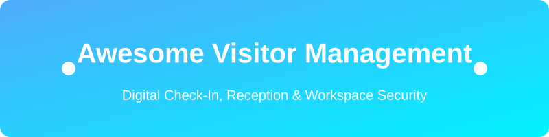

  

# Awesome-Visitor-Management 🏢 🔑 📋

  
  
  

## 🌟 Top Visitor Management Tools Ecosystem
**Curated Directory of SaaS Visitor Management Systems & Open-Source Digital Reception Frameworks for Workspace Security, iPad Kiosks, Badge Printing, Host Notifications, Pre-Registration & Compliance**
*Focused on Digital Reception, Visitor Check-In/Check-Out, Badge Printing, Host Notifications, Pre-Registration & Workplace Security*
**Last updated: August 2026**

This repository tracks notable **SaaS platforms** and **open-source projects** for **Visitor Management**. These tools replace paper logbooks with digital check-in experiences — typically via tablet kiosks or web portals — capturing visitor details, notifying hosts, printing badges, enforcing NDAs or watchlists, and providing audit trails for security and compliance.

**Examples** include Envoy, Proxyclick, HID Safe, The Receptionist, SwipedOn, Veris Welcome, Honeywell Forge Visitor Management, Archie, VisitUs, and Teamgo (the category leaders and widely used platforms).

**Open-source emphasis**: Fully featured commercial-grade open-source visitor management platforms are limited. This section prioritizes the strongest available self-hostable projects for digital check-in, pre-registration, badge generation, and reception workflows that organizations can run and customize themselves.

Contributions welcome! Open a PR to add/update entries. Keep descriptions factual and link to official sites / GitHub repos.

## 📑 Table of Contents
- [SaaS/Hosted Platforms](#saas-hosted-platforms)
- [Open-Source GitHub Projects](#open-source-github-projects)
- [How to Contribute](#how-to-contribute)
- [Disclaimer](#disclaimer)

## ☁️ SaaS/Hosted Platforms

| Platform | Description | Pricing (Starting) | Free Tier / Trial Limit | Valuation / Revenue |
|----------|-------------|--------------------|-------------------------|---------------------|
| **[Honeywell Forge / Sine](https://www.honeywell.com/)** | Visitor and contractor management capabilities within Honeywell’s connected buildings and industrial offerings — strong for sites with induction and safety requirements. | $69/month | 14-day free trial | $10000M+ |
| **[HID Safe](https://www.hidglobal.com/)** | Visitor and contractor management solution from HID, often integrated with physical access control and identity systems. | $50/month | Consultation only (No free trial) | $5000M+ |
| **[Envoy](https://envoy.com/)** | Leading visitor management and workplace platform with polished iPad kiosk experiences, photo capture, NDA signing, host notifications (Slack/Teams), badge printing, and expanding desk/room capabilities. | $99/month | 100 entries/month (Basic Free Plan) | $1400M+ |
| **[Proxyclick](https://www.proxyclick.com/)** | Enterprise visitor management focused on multi-site deployments, approvals, watchlists, and integrations with workplace and HR systems. (Now part of Eptura / Sign In Solutions ecosystem) | $100/month | 15-day free trial | $1000M+ |
| **[iLobby / FacilityOS](https://ilobby.com/)** | Broader ecosystem of freemium and enterprise visitor management solutions frequently evaluated alongside the platforms above. | $199/month | 14-day free trial | $50M+ |
| **[SwipedOn](https://www.swipedon.com/)** | Visitor and contractor sign-in platform with strong mobile and tablet experiences, used across offices and industrial sites. | $52.50/month | 14-day free trial | $20M+ |
| **[The Receptionist](https://thereceptionist.com/)** | iPad-first visitor management system popular for fast deployment, two-way SMS, and straightforward reception workflows. | $52.50/month | 15-day free trial | $15M+ |
| **[Archie](https://archieapp.co/)** | Modern workplace platform that includes visitor management alongside desk and room booking for hybrid offices. | $109/month | 14-day free trial | $15M+ |
| **[Veris Welcome](https://www.veris.in/)** | Visitor management solution offering digital check-in, pre-registration, and workplace arrival experiences. | $50/month | Consultation only (No free trial) | $10M+ |
| **[LobbyTrack](https://www.lobbytrack.com/)** | Broader ecosystem of freemium and enterprise visitor management solutions frequently evaluated alongside the platforms above. | $50/month | 100 visitors/month (Starter Free Plan) | $10M+ |
| **[Greetly](https://www.greetly.com/)** | Broader ecosystem of freemium and enterprise visitor management solutions frequently evaluated alongside the platforms above. | $99/month | 14-day free trial | $10M+ |
| **[VisitUs](https://visitus.com/)** | Additional visitor and workplace arrival platforms serving mid-market and multi-location needs. | $29/month | 7-day free trial (Free Core Plan available) | $5M+ |
| **[Teamgo](https://www.teamgo.co/)** | Additional visitor and workplace arrival platforms serving mid-market and multi-location needs. | $29/month | 30-day free trial | $5M+ |

## 🔓 Open-Source GitHub Projects
- **[visitormanagement](https://github.com/neozhu/visitormanagement)**   
  Open-source systems for digital registration, entry/exit tracking, and campus or institutional visitor logging with modern web UIs.
- **[Django-Visitor-Management-System](https://github.com/shubhamkumar27/Django-Visitor-Management-System)**   
  A standard implementation of a VMS using the popular Python Django framework.
- **[frontdesk](https://github.com/prodstarter/frontdesk)**   
  Open-source visitor management system built with Laravel and Filament PHP. Supports digital check-ins, visitor data management, customizable workflows, and real-time tracking — designed as a modern self-hosted alternative.
- **[EasyVisit](https://github.com/ozzi-/EasyVisit)**   
  Self-hosted digital visitor list and check-in system with tablet support, badge generation, notifications (email/SMS), recurring visitor fast check-in, statistics, and customization options.
- **[people-registry](https://github.com/Codefor-Future/people-registry)**   
  Vue.js "contactless" visitor tracking system that uses QR codes. Visitors scan the code to register their details.
- **[VisitorPortal](https://github.com/P0etInc0de/VisitorPortal)**   
  Open-source Laravel-based visitor management portal featuring pre-registration, reception check-in/out, PDF badge printing, welcome displays, notifications, and role-based access control.
- **[Visitor-Management](https://github.com/FALLEN-01/Visitor-Management)**   
  Python (Flask), MySQL, HTML/CSS/JS VMS offering real-time check-in/out, ID verification, badge printing, host notifications, and reporting.

### Additional Strong Open-Source Options
- Badge design and PDF generation libraries that can be integrated into custom VMS flows.
- Notification and messaging integrations (email, SMS, Slack/Teams webhooks) built on open components.
- Watchlist and simple screening helpers that can be added to self-hosted systems.
- Kiosk-mode browser configurations and tablet lockdown tools for reception hardware.
- Data export and audit-log patterns for compliance reporting.

**Frameworks for building custom systems**: Organizations with development capacity often start with **FrontDesk**, **VisitorPortal**, or **EasyVisit** as the core and extend them with SSO, access-control integrations, or custom branding. For very simple needs, lightweight form + database + notification stacks can be assembled quickly. Full enterprise features (watchlists, multi-site policy engines, deep access-control integration) still typically require commercial platforms.

## 🤝 How to Contribute
1. Fork the repo.
2. Add/edit entries in `README.md` (follow existing format).
3. Include: name, link, 1–2 sentence description, and whether it's SaaS or open-source.
4. Submit PR with a short explanation.

Star the repo if you find it useful!

## ⚠️ Disclaimer
- This is a **community-curated** list — not exhaustive and not an endorsement.
- Visitor management platforms should be evaluated for check-in experience quality, host notification reliability, badge printing, pre-registration, watchlist/NDA support, multi-site capabilities, privacy/compliance (GDPR, etc.), and total cost of ownership.
- Open-source visitor systems give full data ownership and eliminate per-location or per-visitor fees but require hosting, security hardening, backup, and ongoing maintenance. Always assess legal and safeguarding requirements when storing visitor personal data.
---
**Made for workplace experience teams, facility managers, security officers, and organizations that want professional visitor experiences without unnecessary vendor lock-in.**
Let's make digital reception and visitor management more open, private, and under your control.

## 📈 Star History

